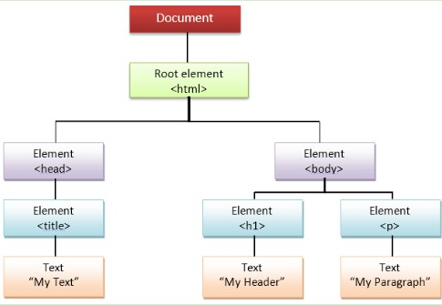

## Chapter 7. DOM - Document Object Model

Resources: https://javascript.info/searching-elements-dom |  https://javascript.info/searching-elements-dom | https://developer.mozilla.org/en-US/docs/Web/API/Document/querySelector


## The DOM Tree

DOM methods and properties are part of Web APIs (libraries provided by the browser). JavaScript can interact with these APIs to access HTML elements and styles. Every element on a webpage can be represented as a node in the DOM Tree.



The DOM is a tree of HTML elements, organized in the nested way they are written in the HTML file.

DOM navigation properties are great when elements are close to each other. When they are not, we can use additional searching methods.

#### document.getElementById(id)
If an element has an `id` attribute, we can get that element using `document.getElementById(id)`, no matter where it is.

Do not forget: each `id` must be unique.

```html
<div id="elem">
  <div id="elem-content">Element</div>
</div>

<script>
  // get the element
  let elem = document.getElementById('elem');

  // make its background red
  elem.style.background = 'red';
</script>
```

#### document.querySelector(css)
The call to `document.querySelector(css)` returns the first element that matches the given CSS selector.

```html
<h1 class="score">Score is 0</h1>
<h2 class="score">High Score is 10</h2>

<script>
  let scoreH = document.querySelector('.score');
  scoreH.innerHTML = 'Score is 5'; // changes h1 score to Score is 5
</script>
```

<h4 style="background-color: yellow;"> Task 7.1: DOM Access and Manipulation </h4>

Starter Code: [T7A_DOM_Manipulation.html](T7A_DOM_Manipulation/T7A_DOM_Manipulation.html) and [7A_DOM_Manipulation.js](T7A_DOM_Manipulation/7A_DOM_Manipulation.js) 


### Selecting HTML Objects

#### document.querySelector(css)
Use `document.querySelector()` to select the first HTML element that matches a CSS selector.
``` html
<!-- HTML -->
<p class="para">
    JavaScript can be used to manipulate text, html attributes and CSS styles!
</p>

```


```javascript
// javaScript
const para = document.querySelector(".para");
```

`".para"` is a class selector (same style as CSS).

### Observe an HTML object properties in the console
Use `console.dir()` to inspect an element object, including its attributes, properties, and methods.

```javascript
console.dir(para);
```

This helps you discover useful properties like `.textContent`, `.innerHTML`, `.value`, and `.style`.

### Text Elements have a textContent property 
Use `.textContent` to read or replace the visible text inside an element.

```javascript
console.log(para.textContent); // access the text of the HTML element
para.textContent = "Changed by JS"; // changing the text of the HTML element
```

### Input Elements have a value property
Inputs are also HTML elements, so you can select and inspect them the same way.

``` html
<!-- HTML -->
<input type="text" id="input" placeholder="Type something here!" />
```

```javascript
// javaScript
const input = document.querySelector("#input");
console.dir(input);
```

`"#input"` is an id selector.

#### Access and change `.value`
Use `.value` for form controls like text inputs.

```javascript
console.log(input.value);
input.value = "Changed textbox input via JS";
```

#### Access raw HTML content with `.innerHTML`
Use `.innerHTML` to read or change the HTML markup inside an element.

```javascript
const demo = document.querySelector(".demo");
console.log("Demo InnerHTML:", demo.innerHTML);
```

#### Append tags using `.innerHTML`
You can add HTML tags by appending to `.innerHTML`.

```javascript
demo.innerHTML += "<p>This is a new paragraph!</p>";
```

#### Access style and change CSS with JavaScript
Select an element, inspect it, then update its style properties.

```javascript
const box = document.querySelector(".box");
console.dir(box);

box.style.backgroundColor = "lightgreen";
box.style.borderRadius = "30px";
```

Use camelCase for CSS property names in JavaScript:
- `background-color` becomes `backgroundColor`
- `border-radius` becomes `borderRadius`

### Permanant
Changing the .textContent, .value, .innerHTML or .style of an object does not permanently change the HTML file itself. It changes what is displayed in the page while the script runs.

### Task 7.1 Instructions (Cross-listed with notes)

1. Select the first paragraph using `document.querySelector(".para")`. (See: Selecting HTML Objects)
2. Use `console.dir()` on the paragraph object to inspect its properties and methods. (See: Observe an HTML object properties in the console)
3. Access and display the paragraph `.textContent` in the console. (See: Text Elements have a textContent property)
4. Change the paragraph `.textContent` to a new message. (See: Text Elements have a textContent property)
5. Select the text input using `document.querySelector("#input")`, and inspect it with `console.dir()`. (See: Input Elements have a value property)
6. Access and display the input `.value`, then change the `.value` to a new message. (See: Access and change `.value`)
7. Select the `.demo` div and display its current `.innerHTML` in the console. (See: Access raw HTML content with `.innerHTML`)
8. Append a new `<p>` tag to the existing `.innerHTML`. (See: Append tags using `.innerHTML`)
9. Select the `.box` element and inspect it in the console to observe style-related properties. (See: Access style and change CSS with JavaScript)
10. Change `.box` styles by updating `backgroundColor` and `borderRadius`. (See: Access style and change CSS with JavaScript)
11. Confirm your understanding that these changes are visual runtime changes and do not permanently overwrite the HTML file. (See: Permanant)


<h4 style="background-color: yellow;"> Task 7.2: Functions and DOM </h4>


Starter Code: [T7B_Functions_DOM.html](T7B_Functions_DOM/T7B_Functions_DOM.html) 

Edit the following HTML so that the button click calls a function that:
1. Selects `paragraph1` and changes the text to "Hi there".
2. Selects `paragraph2` and changes the text to "Goodbye".
3. Shows an alert with the `textContent` of the `h1` element.

```html
<!DOCTYPE html>
<html lang="en" dir="ltr">
  <head>
    <meta charset="utf-8" />
    <title>First Functions For CMP621</title>

    <script>
      function myFunction() {
        alert("I want to change the para1 text to 'Hi there'");
        alert("I want to add an additional line of text to para2. 'Goodbye'");
      }
    </script>
  </head>
  <body>
    <h1>Sample Web Page - Functions and DOM</h1>
    <br />
    <button type="button" name="button" onclick="alert('Need to call Function');">
      Click Me!
    </button>

    <p class="para1">This is para1</p>
    <p class="para2">This is para2</p>
  </body>
</html>
```

#### Changing CSS Styles
You can also use `querySelector()` to manipulate CSS styles.

```javascript
document.querySelector('h2').style.color = 'green';
```


#### Reacting to Events

The guess my number game above has 2 different buttons that the user will click to play the game. Clicking a button is an example of an event, or something that happens to an html element. There are lots of different types of events and the table below shows just a few.

| Event     | Description                                              |
| --------- | -------------------------------------------------------- |
| click     | Event occurs when user clicks on an element              |
| keypress  | Event occurs when user presses a key                     |
| input     | Event occurs when an element gets user input             |
| mouseover | Event occurs when mouse pointer is moved onto an element |


JavaScript can react to events, and execute code when events are detected!
To react to events we can use the addEventListener( ) method. 

#### addEventListener( )
In the example below, an event listener has been added to a button  element with the class name “again”. The .addEventListener method effectively listens or waits for an event, in this case a “click” indicating the user has clicked the button.

Notice the .addEventListener method has 2 arguments: the ‘event’, and the function  (‘click’ , function( )  {}  )


```javascript
document.querySelector(".again").addEventListener("click", again);
```

#### Remove event listeners
```javascript
document.querySelector("selector").removeEventListener( "event" , function_name ) 
```

Only events that have been ADDED with addEventListener can be removed using removeEventListener.